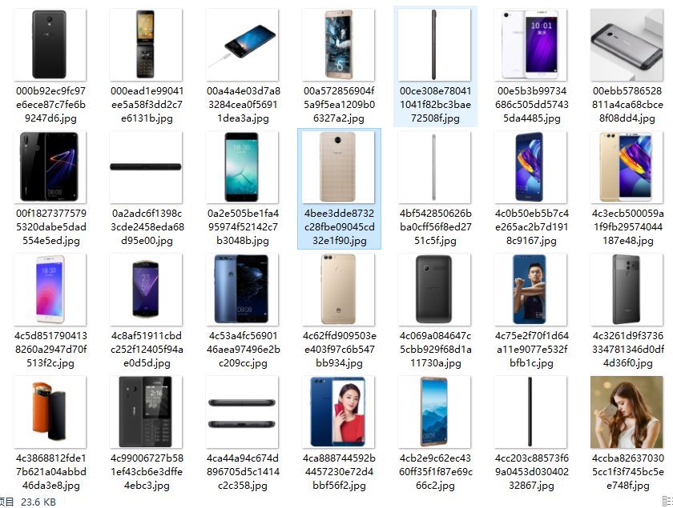
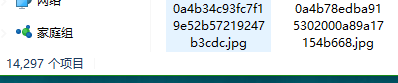
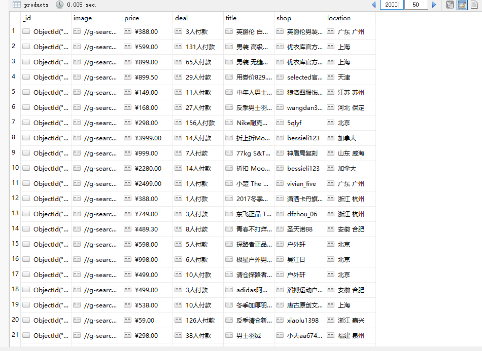
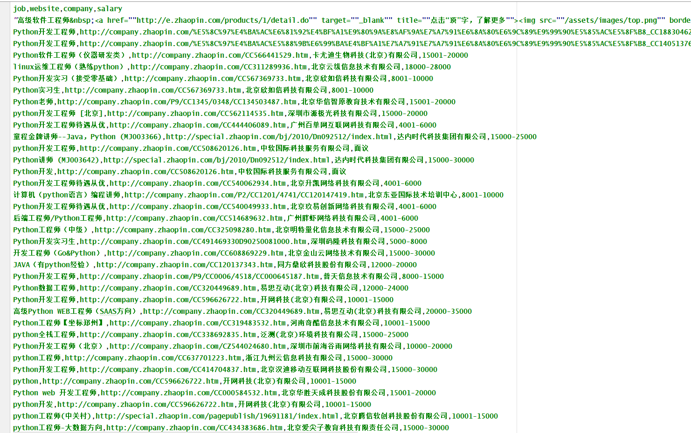
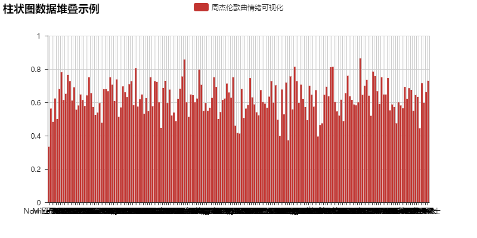
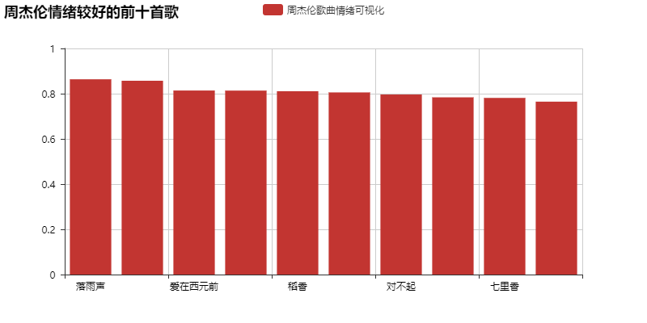
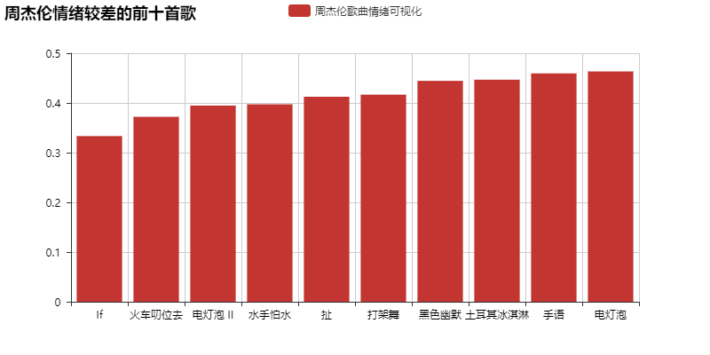

# 爬虫实践
|学校|专业|姓名|邮箱|
|:-------:|:-------------: | :----------:|:-------------: |
|成都大学|软件工程(本)15-2|钟宇航|18990051970@163.com|
## 1. 京东商城-手机页面图片爬取（BeautifulSoup+requests+多线程）
### 1.1 源码如下：

``` python
import requests
from bs4 import BeautifulSoup
import re
from hashlib import md5
from requests.exceptions import RequestException
from multiprocessing import Pool
import sys
import os

def get_index(offset):
	headers = {
		'user-agent':'Mozilla/5.0 (Windows NT 10.0; WOW64) AppleWebKit/537.36 (KHTML, like Gecko) Chrome/63.0.3236.0 Safari/537.36'
	}
	url = "https://list.jd.com/list.html?cat=9987,653,655&page="+offset
	html = requests.get(url, headers=headers)
	# 提取包含所有商品的div
	soup = BeautifulSoup(html.content, 'lxml')
	a = soup.find_all("div",class_="p-img")
	# 将bs4的结果集转化为字符串
	a = str(a)
	# 利用正则表达式获取
	pattern = r'<a href="(.*?)" target="_blank">'
	res = re.compile(pattern, re.S)
	results = re.findall(res, a)
	for result in results:
		yield result


def get_page(url):
	# 具体手机页面爬取图片
	headers = {
		'User - Agent':'Mozilla / 5.0(Windows NT 10.0;WOW64) AppleWebKit / 537.36(KHTML, likeGecko) Chrome / 63.0.3236.0Safari / 537.36'
	}
	url = 'https:'+url
	html = requests.get(url, headers=headers)
	soup = BeautifulSoup(html.content, 'lxml')
	a = soup.find_all("div", class_="spec-items")
	a = str(a)
	pattern = 'src="(.*?)n5/.*?" data-url="(.*?)"'
	res = re.compile(pattern, re.S)
	result = re.findall(res, a)
	for i in result:
		yield 'http:'+i[0]+'n1/s450x450_'+i[1]

def download_pic(url):
	headers = {
		'Accept': 'text / html, application / xhtml + xml, application / xml;q = 0.9, image / webp, image / apng, * / *;q = 0.8',
	'Accept - Encoding': 'gzip, deflate',
	'Accept - Language': 'zh - CN, zh;',
	'User - Agent': 'Mozilla / 5.0(WindowsNT10.0;WOW64) AppleWebKit / 537.36(KHTML, likeGecko) Chrome / 63.0.3236.0Safari / 537.36'
	}
	try:
		html = requests.get(url, headers=headers)
		content = html.content
		print(url)
		print(html.status_code)
		if html.status_code == 200:
			file_path = "{0}/{1}/{2}.{3}".format(sys.path[0], 'iphone', md5(content).hexdigest(), 'jpg')
			if not os.path.exists(file_path):
				with open(file_path, 'wb') as f:
					f.write(content)
					f.close()
			return 1
	except RequestException:
		print('请求图片失败', url)
		return None

def main(offset):
	for  url in get_index(offset):
		for image_url in get_page(url):
			download_pic(image_url)

if __name__ == '__main__':
	groups = [str(x) for x in range(1,60)]
	pool = Pool()
	pool.map(main, groups)

```

### 1.2 抓取结果截图：





## 2. mzitu网站照片爬取（BeautifulSoup+requests+多线程）

### 2.1 源码如下：

```class 
import requests
from bs4 import BeautifulSoup
import sys
import os
from hashlib import md5
from requests.exceptions import RequestException
from multiprocessing import Pool


'''
	爬取妹子图(http://www.mzitu.com/page/)最新套图
'''

# 爬取热点图的每一页的套图的链接
def get_url(offset):
	url = "http://www.mzitu.com/page/" + str(offset)
	headers = {
		'Cookie': 'Hm_lvt_dbc355aef238b6c32b43eacbbf161c3c = 1523859284, 1524038568;Hm_lpvt_dbc355aef238b6c32b43eacbbf161c3c = 1524038865',
		'User-Agent': 'Mozilla/5.0 (Windows NT 10.0; WOW64) AppleWebKit/537.36 (KHTML, like Gecko) Chrome/63.0.3236.0 Safari/537.36'
	}
	html = requests.get(url, headers=headers)
	soup = BeautifulSoup(html.content, 'lxml')
	bs = soup.select('ul[id="pins"] a')
	for item in bs:
		yield item.get('href')

# 得到每一个套图的最大页数,并加上超链接发给get_page_index
def get_maxpage(url):
	headers = {
		'Cookie': 'Hm_lvt_dbc355aef238b6c32b43eacbbf161c3c = 1523859284, 1524038568;Hm_lpvt_dbc355aef238b6c32b43eacbbf161c3c = 1524038865',
		'User-Agent': 'Mozilla/5.0 (Windows NT 10.0; WOW64) AppleWebKit/537.36 (KHTML, like Gecko) Chrome/63.0.3236.0 Safari/537.36'
	}
	html = requests.get(url, headers=headers)
	bs = BeautifulSoup(html.content, 'lxml')
	# 获取每一个图套的最大页数
	max_page = (bs.select('div[class="pagenavi"] a span'))[-2].text
	for i in range(1, int(max_page) + 1):
		url_pic = url+'/'+str(i)
		yield url_pic


# 得到套图每一页的下载地址
def get_page_index(url):
	headers = {
		'Cookie': 'Hm_lvt_dbc355aef238b6c32b43eacbbf161c3c = 1523859284, 1524038568;Hm_lpvt_dbc355aef238b6c32b43eacbbf161c3c = 1524038865',
		'User-Agent': 'Mozilla/5.0 (Windows NT 10.0; WOW64) AppleWebKit/537.36 (KHTML, like Gecko) Chrome/63.0.3236.0 Safari/537.36'
	}
	response = requests.get(url, headers=headers)
	bs = BeautifulSoup(response.text, 'lxml')
	a = bs.select('div[class="main-image"] img')
	for li in a:
		yield li.get('src')


def download_pic(url):
	headers = {
		'Cookie': 'Hm_lvt_dbc355aef238b6c32b43eacbbf161c3c = 1523859284, 1524038568;Hm_lpvt_dbc355aef238b6c32b43eacbbf161c3c = 1524038865',
		'User - Agent': 'Mozilla / 5.0(Windows NT 10.0;WOW64) AppleWebKit / 537.36(KHTML, likeGecko) Chrome / 63.0.3236.0Safari / 537.36',
		'Referer':'http://www.mzitu.com/'
	}
	try:
		html = requests.get(url, headers=headers)
		content = html.content
		print(url)
		print(html.status_code)
		if html.status_code == 200:
			file_path = '{0}/{1}/{2}.{3}'.format(sys.path[0], 'new', md5(content).hexdigest(), 'jpg')
			if not os.path.exists(file_path):
				with open(file_path, 'wb') as f:
					f.write(content)
					print("图片下载成功")
		return 1
	except RequestException:
		print('请求图片失败', url)
		return None


def main(offset):
	for url in get_url(offset):
		for next_url in get_maxpage(url):
			for final_url in get_page_index(next_url):
				download_pic(final_url)

if __name__ == '__main__':
	# groups定义http://www.mzitu.com/page/ 页面爬虫条数
	groups = [x for x in range(1, 176)]
	pool = Pool()
	pool.map(main, groups)


``` 

#### 2.2 大概爬取了1W+图片（由于不可描述原因，图片就不展示了）：




### 3 淘宝商品抓取--存储到mongodb（selenium+mongodb）

#### 3.1 源码如下：

``` class

from selenium import webdriver
from selenium.common.exceptions import TimeoutException
from selenium.webdriver.common.by import By
from selenium.webdriver.support import expected_conditions as EC
from selenium.webdriver.support.wait import WebDriverWait
from urllib.parse import quote
from pyquery import PyQuery as pq
import pymongo

browser = webdriver.Chrome()
wait = WebDriverWait(browser, 10)
MAX_PAGE = 100
KEYWORD = '男式羽绒服'
MONGO_URL ='localhost'
MONGO_DB = 'taobao'
MONGO_COLLECTION = 'products'
client = pymongo.MongoClient(MONGO_URL)
db = client[MONGO_DB]

def index_page(page):
	"""
	抓取索引页
	:param page:页码
	:return:
	"""
	print('正在爬取第', page, '页')
	try:
		url = 'https://s.taobao.com/search?q=' + quote(KEYWORD)
		browser.get(url)
		if page > 1:
			input = wait.until(
				EC.presence_of_element_located((By.CSS_SELECTOR, '#mainsrp-pager div.form > input')))
			submit = wait.until(
				EC.element_to_be_clickable((By.CSS_SELECTOR, '#mainsrp-pager div.form > span.btn.J_Submit')))
			input.clear()
			input.send_keys(page)
			submit.click()
		# 等待跳转后的页面代码高亮
		wait.until(
			EC.text_to_be_present_in_element((By.CSS_SELECTOR, '#mainsrp-pager li.item.active > span'), str(page)))
		# .m-itemlist .items .item这个选择器对应的是每个商品的信息块
		wait.until(
			EC.presence_of_element_located((By.CSS_SELECTOR,'.m-itemlist .items .item')))
		# 如果加载成功，就执行后续的 get_products()方法
		get_products()
	except TimeoutException:
		index_page(page)

def get_products():
	"""
	提取商品数据
	:return:
	"""
	html = browser.page_source
	doc = pq(html)
	items = doc('#mainsrp-itemlist .items .item').items()
	for item in items:
		product = {
			'image': item.find('.pic .img').attr('data-src'),
			'price': item.find('.price').text(),
			'deal': item.find('.deal-cnt').text(),
			'title': item.find('.title').text(),
			'shop': item.find('.shop').text(),
			'location': item.find('.location').text()
		}
		print(product)
		save_to_mongo(product)

def save_to_mongo(result):
	"""
	保存至MongoDB
	:param result:结果
	:return:
	"""
	try:
		if db[MONGO_COLLECTION].insert(result):
			print('存储到MongoDB成功')
	except Exception:
		print('存储到MongoDB失败')

def main():
	"""
	遍历每一页
	:return:
	"""
	for i in range(1, MAX_PAGE + 1):
		index_page(i)

main()

``` 

#### 3.2 抓取结果截图：




### 4 智联网信息抓取--生成CSV文件，存储到本地项目（requests+csv+re）

#### 4.1 源码如下：
``` class
import re
import requests
import csv
from tqdm import tqdm
from urllib.parse import urlencode
from requests.exceptions import RequestException


def get_one_page(city, keyword, region, page):
	# 获取网页内容并返回
	paras = {
		'jl': city,  # 搜索城市
		'kw': keyword,  # 搜索关键词
		'isadv': 0,  # 是否打开更详细搜索
		'isfilter': 1,  # 是否对结果过滤
		'p': page,  # 页数
		're': region,  # region的缩写，地区
	}

	headers = {
		'Host': 'sou.zhaopin.com',
		'Referer': 'http: // sou.zhaopin.com / jobs / searchresult.ashx?jl = % E5 % 8C % 97 % E4 % BA % AC & kw = python % E5 % B7 % A5 % E7 % A8 % 8B % E5 % B8 % 88 & p = 1 & isadv = 0',
		'Upgrade - Insecure - Requests': '1',
		'User - Agent': 'Mozilla / 5.0(WindowsNT10.0;WOW64) AppleWebKit / 537.36(KHTML, likeGecko) Chrome / 63.0.3236.0Safari / 537.36',
	}

	url = 'http://sou.zhaopin.com/jobs/searchresult.ashx?' + urlencode(paras)
	try:
		response = requests.get(url, headers=headers)
		if response.status_code == 200:
			return response.text
		return None
	except RequestException as e:
		return None


def parse_one_page(html):
	# 解析HTML代码，提取有用信息并返回
	# 正则表达式进行解析
	pattern = re.compile('<a style=.*? target="_blank">(.*?)</a>.*?'  					# 匹配职位信息
						 '<td class="gsmc"><a href="(.*?)" target="_blank">(.*?)</a>.*?'  	# 匹配公司网址和公司名称
						 '<td class="zwyx">(.*?)</td>', re.S)  								# 匹配月薪

	items = re.findall(pattern, html)

	for item in items:
		job_name = item[0]
		job_name = job_name.replace('<b>', '')
		job_name = job_name.replace('</b>', '')
		yield {
			'job': job_name,
			'website': item[1],
			'company': item[2],
			'salary': item[3],
		}

def write_csv_file(path, headers, rows):
	# 将表头和行系写入csv文件
	with open(path, 'a', encoding='utf8', newline='') as f:
		f_csv = csv.DictWriter(f, headers)
		f_csv.writeheader()
		f_csv.writerows(rows)

def write_csv_headers(path, headers):
	# 写入表头
	with open(path, 'a', encoding='utf8', newline='') as f:
		f_csv = csv.DictWriter(f, headers)
		f_csv.writeheader()

def write_csv_rows(path, headers, rows):

	# 写入行
	with open(path, 'a', encoding='utf8', newline='') as f:
		f_csv = csv.DictWriter(f, headers)
		f_csv.writerows(rows)

def main(city, keyword, region, pages):
	'''
	:param city: 想要查询的城市
	:param keyword: 想要查询的职位
	:param region: 具体的城市代码
	:param pages: 查询页数
	:return: 项目目录下生成一个csv文件，包含了职业名称、公司名称、公司网址、薪酬
	'''
	filename = 'zl_' + city + '_' + keyword + '.csv'
	headers = ['job', 'website', 'company', 'salary']
	write_csv_headers(filename, headers)
	for page in tqdm(range(1, pages+1)):
		jobs = []
		html = get_one_page(city, keyword, region, page)
		items = parse_one_page(html)
		for item in items:
			jobs.append(item)
		write_csv_rows(filename, headers, jobs)


if __name__ == '__main__':
	# 2381是高新区
	main('成都', 'python', 2381, 10)

```

#### 4.2 抓取结果截图：




##5. 网易云音乐爬取周杰伦歌曲歌词，并进行可视化分析（jieba分词+requests+pyecharts+snownlp情绪分析）

###5.1 [点击看源码](https://github.com/zhongyuhang/spiderLearning/lyricAnalysis.py)

###5.2 目前做出来的图表：




